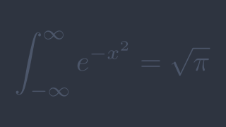

# A Reanimate Animation

<p align="center">
  
</p>

## About

This is a test repository for learning the [Reanimate](https://hackage.haskell.org/package/reanimate) animation library.

It can be used as a starting point for creating new animations.

## Building

I ran into a lot of problems trying to use the `reanimate` library with `stack`. 

It turned out to be a lot of trial and error to figure out what `ghc` compiler version was able to compile to library. The latest version that I was able to get working is `lts-18.28`.

To build the animation, run the following command:

```bash
$ stack build
```

To compile the animation, run the following command:

```bash
$ stack app/Main.hs -- render --format gif --compile
```
